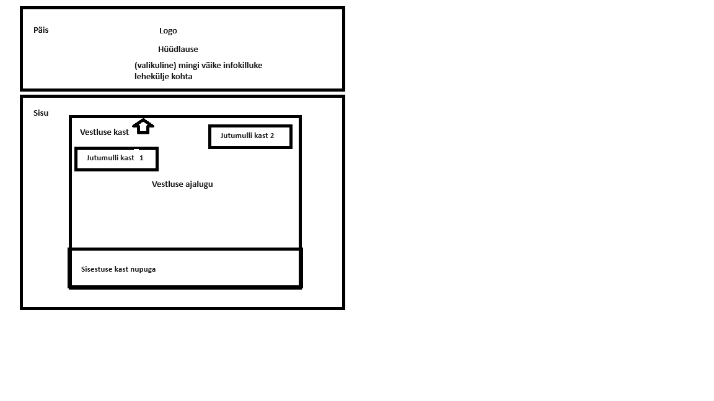

# cook-rook-ies

Eesmärk oli teha lihtne juturobot, kus kasutaja saaks vestelda AI-ga. Ülesande jaoks kitsendasin teemat: teha juturobot retseptide genereerimiseks. Kuigi juturobot ei ole sptesialiseerunud ainult kokandusele, aitas see kitsendus paremini erinevaid ideid kujunduse osas genereerida. Minu jaoks kokkamine seostub soojade pruunide värvidega nagu küpsis šokolaaditükkidega või ahjus küpsetatud kana.

## Arenduse käik
### Koodi struktuur
Esmalt tegin endale skeemi valmis:

Seejärel hakkasin seda teostama. Esmalt oli tähtis asi tööle saada ja seejärel jagasin koodi väiksematesse failidesse. Nii on lihtsam erinevaid veebilehekülje osasid hallata, kui kood on võimalikult lühike ja funktsionaalsus on vaid ühe olulisema kasti kohta.

Kõige olulisem oli minu jaoks, et oleks ära eraldatud juturoboti päringute loogika ja üldine veebilehekülje UI, sest need on mõlemad eraldiseisvad komponendid ja kui need on eraldi, on neid võimalik kerge vaevaga ka välja vahetada.

Nii kujuneski välja, et `app` kaustas on AI poole päringu tegemise fail `ai_actions.ts` ja UI peafail `page.tsx`. Kaustas `app\ui` on kaks suuremat kasti: päis ja vestlus ise. Kaustas `app\ui\chat-box-elements` on vestluse kastiga seotud komponendid.

Ainuke asi, mis jäi kriipima, on fail app/ui/chat-box.tsx. Võib-olla saaks sealt ka funktsioonid välja tõmmata eraldi faili, kuigi kuna fail ise pole praegu pikk.

Pole harjunud koodi kommenteerima. Pigem kasutan kirjeldavaid funktsioonide/muutujate nimesid.

### Kasutajasõbralikkus

Mõned punktid, mis teevad lehekülje kasutajasõbralikuks:
*  Ei ole silmikriipivaid kontrastseid värve
*  Lühike kirjeldus lehe kohta.
*  Vestluseaken läheb laiemaks ja logo väiksemaks, kui tegemist kitsama ekraaniga
*  On võimalik kergesti aru saada, et kus on roboti ja kus kasutaja tekst.
*  Logo-l on olemas alt tekst vaegnägijatele
*  Minimalistlik

### Disain

Varasemalt olen ainult puhast CSS-i kasutanud, siin aga kasutasin Tailwindi, et proovida midagi uut. Olen seda teistel näinud ja kuulnud, et väga kerge on kasutada. Tõesti oli palju lihtsam, kui eraldi .css failis seda teha. Eraldi .css failis oleksin tõenäoliselt proovinud kõike üldistada ja rohkem sattunud probleemide otsa. Tailwindi kasutades oli mul kerge keskenduda iga komponendi kujundusele eraldi. Küll tekitas küsimusi, et mis on head tavad Tailwindiga. Kindlasti peaks kuhugi ära kirjeldama erinevad värvid, mida ma hetkel olen lihtsalt igale poole hard-codenud komponentidesse. Muid asju praegu targema soovituseta ei oskaks koondada eraldi faili.

### Testplaan

Ma testiksin ainult UI osa. AI päringute testimisele pole minu meelest mõtet keskenduda, kuna tegemist kolmanda osapoolega ja pigem on see nende vastutus testida.

Päise testimine
*  Kas on logo ja kõik headerid olemas lehe esmasel renderdamisel

Keha testimine - siin teeksin palju erinevaid pisemaid. Kuna ise pole arenduses teste kirjutanud, siis täpselt ei tea, kui detailselt peaks testima. Oluline on, et kas pärast igat kasutaja tegevuse järel on ka õige tagajärg. Igatahes järgnevalt toon välja olukorrad, mida võiks testida.
*  Kas keha komponendid on olemas lehe esmasel renderdamisel
*  Kasutaja sisestab inputfieldi teksti ning enter klahvi või "Send" nupu vajutamisel
  *  inputfield tühjeneb ära
  *  uueneb vestluse ajaloo list
*  Kui vestluse ajaloo listi lisandub kasutaja sisestatud tekst, siis tehakse päring AI poole, vastasel juhul ei tehta midagi
*  Kui vestluse ajaloo listi lisandub tekst, siis uueneb ka vestluse ajaloo vaade
*  Useri vestluse ajalugu on paremal pool, AI oma vasakul pool

### Ohud

*  Kui AI genereerib pikemat teksti, siis ei tea kasutaja, kas kõik on ikka korras või tuli mingi error, kuna praegu ei anta teada, et kasutaja peaks veidi ootama. Lahendamiseks on 2 võimalust: tekitada kolmepunktiline jutumull AI poolele tähistamiseks, et näidata AI mõtlemist, või siis kasutada päringut, mis striimiks AI poolt genereeritavat teksti, et tekiks mulje nagu AI otse kirjutab, nagu praegu ChatGPT puhul.
*  Ma ei tea, kui hästi on valitud värvid värvipimedate jaoks. Seda peaks üle vaatama ja vajadusel värvid ära vahetama. Esmalt valisin sellised värvid välja, aga ei leidnud võimalust, kuidas võiks siniseid värve juurde lisada. https://coolors.co/cbac88-644536-eaded7-5c9ead-326273
*  Ei testinud, kui hea veebilehekülg on vaegnägijatele ehk kui kerge on neil liigelda veebileheküljel kasutades abirakendusi.
*  Ei ole testinud volditava telefoniga.
*  Koodi on ingliskeelsed tekstid hard-codetud. Need tekstid võiks kuhugi eraldi faili panna, et vajadusel oleks kerge üles leida kõik tekstid ja vajadusel neid korrigeerida.
*  Kasutaja ei pruugi kohe aru saada, et mis ta tegema peaks. Võiks näiteks mõned näidislaused või siis inputfieldi panna juhuslik sobilik lause.
*  Viimasel päeval avastasin, et dev ja build genereeritud leheküljed käituvad erinevalt :D Vestluse ajaloo mullid on erinevas järjekorras (ühel juhul on järjekord indeksitel kahanevas ning teisel juhul kasvavas järjekorras). Selle debuggimiseks prooviksin leida ja isoleerida vigase koodi ning logida maha erinevatel hetkedel olevad väärtused, et aru saada, mis hetkel ei tehta seda, mida ootan.
